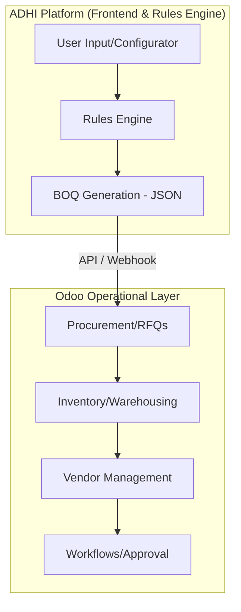

# ADHI System Presentation Guide: Odoo Partner Alignment Meeting

**Date**: Monday, March 29, 2026  
**Subject**: ADHI Platform & Odoo Integration Alignment  
**Presenter**: IT Department (ADHI)

---

## 1. Objective of the Session
Present the current ADHI platform architecture and align with the Odoo partner on the technical and operational boundaries. 

> [!IMPORTANT]
> This session is for **system alignment**, not immediate implementation. The goal is to define how Odoo will consume ADHI's structured construction data.

---

## 2. Current Platform (Frontend)
The ADHI frontend is a modern React-based ecosystem designed to provide role-specific intelligence across multi-regional construction nodes.

### 2.1 Dashboards & Role-Based Views
We have built tailored views for different stakeholders, ensuring every part of the organization has the data they need:

| Module | Core Logic | Key Metrics |
| :--- | :--- | :--- |
| **Housing** | Project Progress & Regional Distribution | Completed Units, Active Nodes, Regional Status (Nairobi, Mombasa, etc.) |
| **Procurement** | Supply Request Tracking & Inventory Forecast | Active Orders, Materials Allocated, Stock Health |
| **Academy** | Certification & Workforce Training | Total Trainees, Certified Teams, Active Course Schedule |
| **Climate** | Sustainability & Carbon Credit Verification | Carbon Credits (Verified/Pending), Sustainability Score (82%) |

### 2.2 System Architecture Highlights
- **Multi-region visual logic**: Handles disparate data from various city nodes.
- **Role Intelligence**: Automatic dashboard adjustments based on user permissions (Admin, Franchisee, Government, Investor).
- **Mock Data Layer**: Built to simulate real-world construction cycles, ensuring the UI is ready for production APIs.

---

## 3. House-in-a-Kit System Logic
The core "intelligence" of ADHI resides in the digital construction logic. This logic translates architectural intent into physical material requirements.

### 3.1 Digital Construction Workflow
1.  **Inputs**: User selects configurable parameters (House Type, Wall Panels, Window Placements, etc.).
2.  **Rules Engine**: A logic layer that calculates precise quantities for every component (panels, blocks, roof trusses, glass).
3.  **BOQ Generation**: The output is a structured **Bill of Quantities (BOQ)**.

### 3.2 Structured Output (JSON)
The ADHI system does not send "raw requests." It sends structured JSON data to the operational layer.

```json
{
  "project_id": "ADHI-NBO-004",
  "kit_type": "Model M - 2 Bed",
  "components": [
    { "item": "Steel Frame - P1", "qty": 42, "unit": "PCS" },
    { "item": "Standard Wall Panel", "qty": 124, "unit": "PCS" },
    { "item": "Galvanized Roofing Sheet", "qty": 18, "unit": "PCS" }
  ],
  "delivery_target": "2026-05-15"
}
```

---

## 4. Integration Strategy: Defining the Boundaries

### 4.1 System Logic Flow Diagram



### 4.2 Expected Role of Odoo
- **No Construction Logic**: Odoo should **not** calculate quantities or house logic. It receives the "What" from ADHI.
- **Operations Focus**: Odoo handles Procurement, Suppliers, Inventory, and Financial Workflows.
- **Data Consumer**: Odoo consumes the structured BOQ to initiate POs (Purchase Orders).

---

## 5. Suggested Odoo Modules for Alignment
We recommend focusing on these modules for the initial integration phase:

1.  **Odoo Inventory (Stock Management)**: For multi-warehouse tracking across regions.
2.  **Odoo Purchase (Procurement)**: For managing global supplier relationships and RFQ cycles.
3.  **Odoo Manufacturing (MRP)**: For potential local component pre-assembly workflows.
4.  **Odoo Project**: For operational task management at the site level.

---

## 6. Key Principles & Closing Message
- **Frontend handles user interaction**.
- **Rules engine handles calculation and logic**.
- **Odoo handles operations (procurement and inventory)**.
- **System layers remain separated**.

> [!TIP]
> **Key Message for Ahmed & Partner**:  
> The construction logic and BOQ generation remain in the ADHI platform. Odoo should **consume structured outputs**, not recreate or override them. This ensures stability and single-source-of-truth for construction engineering.

---

## 7. Expected Outcome of Meeting
1.  Agreement on Odoo's role as the **operational consumer**.
2.  Alignment on the **API/Webhook integration approach**.
3.  Definition of **architecture next steps** (no immediate code required).

---
*Prepared by Antigravity (ADHI AI Lead)*
